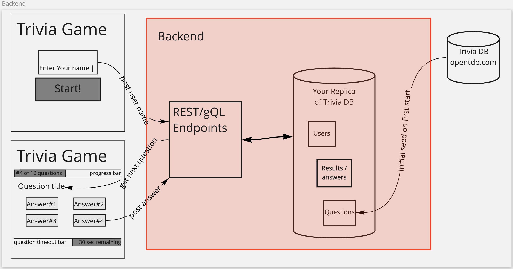
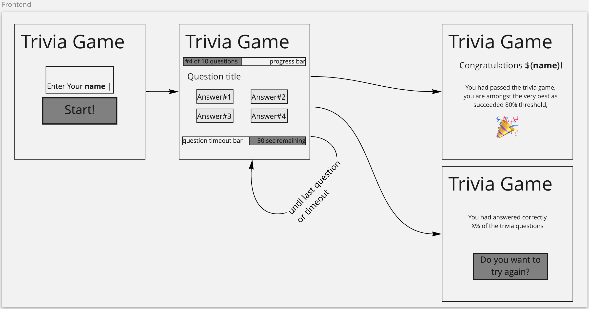

# FinnoconsultTestTrivia

## Welcome!
**Dear Applicant,**

We warmly welcome you on behalf of the  development team.

This is the welcome page of your `HomeWork`, which is a blanket project, generated using [Nx, a Smart, Extensible Build Framework.](https://nx.dev)

> 💡 If you are unfamiliar with Nx, might worth checking their [few minutes intro](https://nx.dev/l/n/getting-started/intro)

 
 
 
 

# Your Task

We would like you to demonstrate your development skills and shine while creating a `Multiple choice Trivia Game` application.

You can use the following trivia questions as your question seed: https://opentdb.com/api.php?amount=10&category=9&difficulty=medium&type=multiple&encode=url3986

> 💡 You can also generate new topics using the Trivia API: https://opentdb.com/api_config.php.
Please select your type to be `Multiple Choice`
## Fork the repo
 Please fork this repo to your private GitHub user, so that you can commit to your own repo directly.
 Please make the forked repo public. Anyway you'll benefit from having a new pet-project under your own github profile.
## Do the chore
### Backend tasks

The backend application is to be implemented in the `apps/api`, as an `express` application.
You are free to add any libraries, and construct your desired file/directory structure.

The workflow and structure indicated in `red` is your task to implement:

#### **Your tasks are:**
1. constructa a local database to store trivia data (can be either noSQL, SQL or in-memory, upon your preference)
    - users
    - questions
    - answers
2. on first starting your backend
    - all the tables you need (questions, user, results, etc) shall be created
    - the `Trivia question list` data shall be fetched from the external Trivia DB,
    - and store int your database, as a "data seed"
3. establish the endpoints which would serve for the frontend.

This task be completed in 3-5 hours

> Optional features if you still have more time:
> - timeout handling on receiving the answer for the question

### Frontend Components and Workflow
You need to comply with the following Frontend UI workflow according to the wireframe:

The workflow:
  - `Name` of the player shall be stored from the welcome page as a state
  - Trivia question page
  - Final page(s) with results

> Optional features if you still have more time:
> - timeout handling per question, indicated with a timeout bar on the frontend.

The UI elements are already added to `apps/microfrontend2`, but the data connection is not implemented towards to the backend.

#### **Your tasks are**:
1. use the provided components from `apps/microfrontend2` to establish the workflow towards to the backend
2. make api calls from frontend to backend

# How to work with this repo
## Adding capabilities to your workspace

You are free to add any libraries, components, new features and files of your preference, with or without Nx.

However, Nx supports many plugins which add capabilities for developing different types of applications and different tools which might accelerate your work.

These capabilities include generating applications, libraries, etc as well as the devtools to test, and build projects as well.

Some core plugins were already added: `@nrwl/react, @nrwl/web, @nrwl/express, @nrwl/node`
Currently the backend is an `express` app and the frontend is `React`.

> 💡 If you'd like to add support for other frameworks or plugins, you can [check the community plugins](https://nx.dev/community) or add [Nest](https://nestjs.com) by invoking `npm install --save-dev @nrwl/nest`

## Generate a library

Run `nx g @nrwl/react:lib my-lib` to generate a library.

> 💡 You can also use any of the plugins above to generate libraries as well.

Libraries are shareable across libraries and applications. They can be imported from `@finnoconsult-test-trivia/mylib`.

## Code scaffolding

Run `nx g @nrwl/react:component my-component --project=my-app` to generate a new component.

## Development server

As this project has both a frontend and backend, you need to run both of them for your best development experience, with the command `yarn dev`.

Navigate to `http://localhost:4200/`. The app will automatically reload if you change any of the source files.

The backend will listend on `http://localhost:3333/` and your frontend will automatically look for these endpoints.

# Miscellaneous

## Generate a new application

When using Nx, you can create multiple applications and libraries in the same workspace.

Run `nx g @nrwl/react:app my-app` to generate a new application (either new microfrontend or microbackend) under `apps` folder.

> You can use any of the plugins above to generate applications as well.

 
 
 
 
 
 
 
 
 
 
 
 

# This is what you ain't gonna need:

## Build

Run `nx build my-app` to build the project. The build artifacts will be stored in the `dist/` directory. Use the `--prod` flag for a production build.

## Running unit tests

Run `nx test my-app` to execute the unit tests via [Jest](https://jestjs.io).

Run `nx affected:test` to execute the unit tests affected by a change.

## Running end-to-end tests

Run `ng e2e my-app` to execute the end-to-end tests via [Cypress](https://www.cypress.io).

Run `nx affected:e2e` to execute the end-to-end tests affected by a change.

## Understand your workspace

Run `nx dep-graph` to see a diagram of the dependencies of your projects.

## Further help

Visit the [Nx Documentation](https://nx.dev) to learn more.

## ☁ Nx Cloud

### Distributed Computation Caching & Distributed Task Execution

Nx Cloud pairs with Nx in order to enable you to build and test code more rapidly, by up to 10 times. Even teams that are new to Nx can connect to Nx Cloud and start saving time instantly.

Teams using Nx gain the advantage of building full-stack applications with their preferred framework alongside Nx’s advanced code generation and project dependency graph, plus a unified experience for both frontend and backend developers.

Visit [Nx Cloud](https://nx.app/) to learn more.
